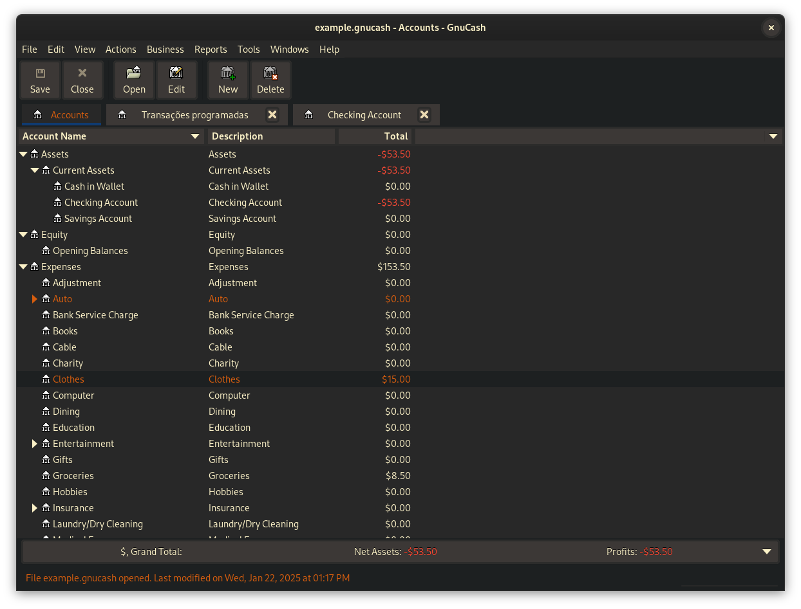
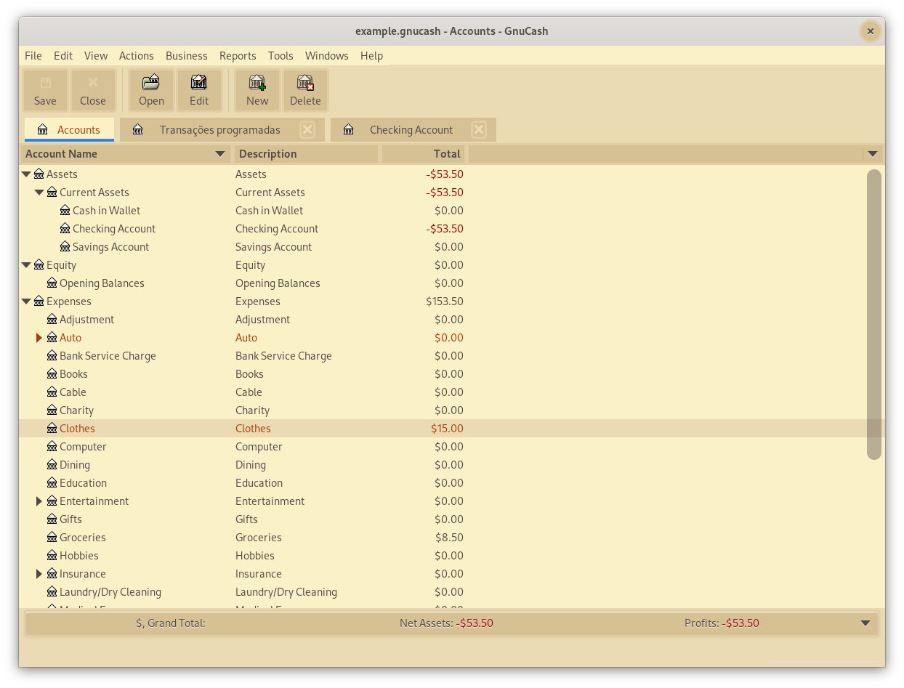
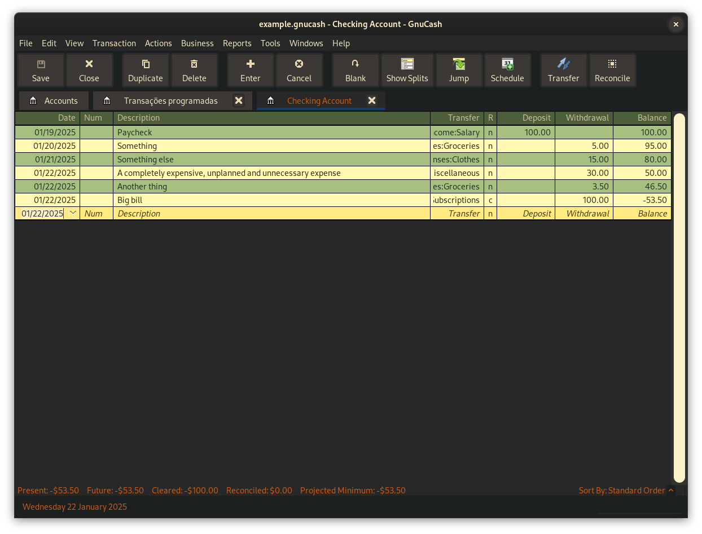
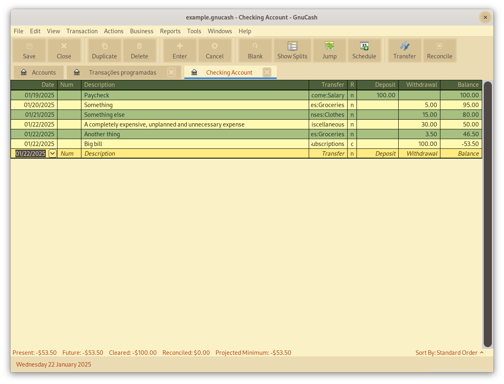

# gruvbox theme for GnuCash

Dark mode             |  Light mode
:-------------------------:|:-------------------------:
  |  
  |  


A custom theme developed by reading the docs and searching the internet
for help, examples, and troubleshooting.
GnuCash [mailing lists](https://wiki.gnucash.org/wiki/Mailing_Lists) and [r/GnuCash](https://www.reddit.com/r/GnuCash/) subreddit were also a great help.

It implements a series of changes not covered by the official sample template, 
possibly making it a better starting point for new themes or your own custom styling.

## Install

Instructions can be found at [gnucash.org/wiki](https://wiki.gnucash.org/wiki/GTK3#Via_css).

Basically, you have to copy the desired `gtk-3.0.css` file to the [`USER_CONFIG_HOME`](https://wiki.gnucash.org/wiki/Configuration_Locations#GNC_CONFIG_HOME) folder.

In Linux systems, you can install it directly by downloading via `wget`:

### Dark mode:

``` bash
wget https://raw.githubusercontent.com/ggio/gnucash_gruvbox/refs/heads/main/gruvbox-dark/gtk-3.0.css -P ~/.config/gnucash
```

### Light mode:

``` bash
wget https://raw.githubusercontent.com/ggio/gnucash_gruvbox/refs/heads/main/gruvbox-light/gtk-3.0.css -P ~/.config/gnucash
```

## Optional: choose a dark window theme with `gnome-tweaks`

For a fully dark appearance, it is recommended that you also select a dark theme for legacy applications with [`gnome-tweaks`](https://bytexd.com/how-to-install-and-use-gnome-tweaks-tool-in-ubuntu/).

## References

- [obsidian_gruvbox](https://github.com/insanum/obsidian_gruvbox) -
basic colors and starting point.
- [gnucash/doc/gtk-3.0.css](https://github.com/Gnucash/gnucash/blob/stable/doc/gtk-3.0.css) - official sample CSS file.

## License

[MIT License](./LICENSE)
